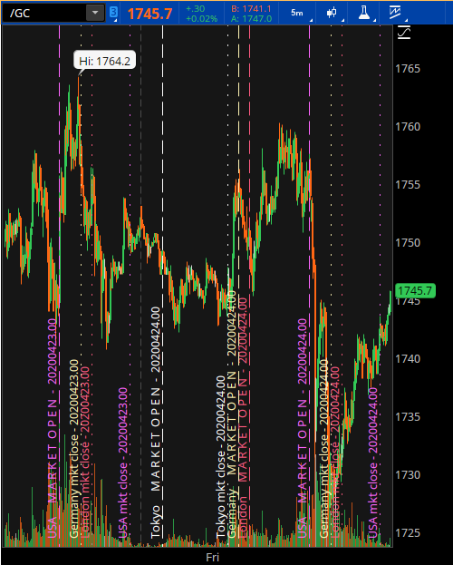
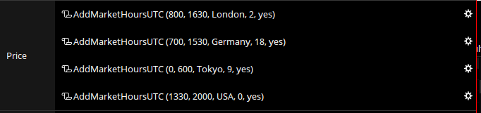

# thinkorswim scripts (studies)

Scripts for [thinkorswim](https://www.tdameritrade.com/tools-and-platforms/thinkorswim/) trading platform. 

## [AddMarketHoursUTC](AddMarketHoursUTC.ts)

Adds visual line on chart for given open/close hours (in UTC). Helpful to see which markets / areas price movements may be originating.

Unfortunately thinkscript is pegged to eastern time and therefore affected by daylight saving time. A flag is provided to denote this. There is commented code to intuit whether or not there is daylight saving time, but thinkscript's `SecondsTillTime` does not accept the output of a function call. 

**Visual example**

**Configuration example**

